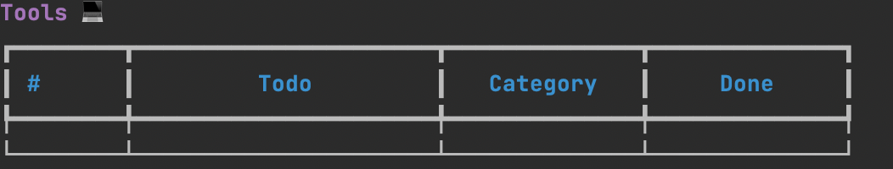
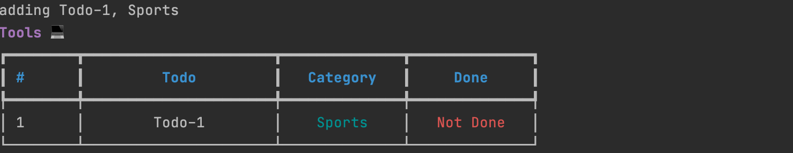
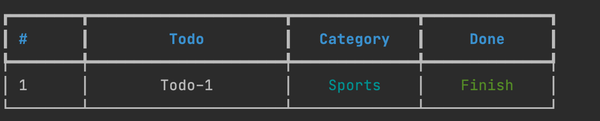

## Python Tutorial

You can learn how to build a terminal application(CLI application) to manage your task and tools. 

You will use typer for building this CLI application. 
And use Rich for a colorized terminal output and SQLite for the database. 


#### 1. When the SQLite is empty, you show the CLI application
```python
python todo.py show
```


#### 2. You could add 1 item, the status of Done is 'Not Done'
```python
python todo.py add "Todo-1" "Sports"
```


#### 3. You could edit the status of Done, make it 'Finish'
```python
python todo.py complete 1
```


#### 4. You could add 1 item and delete this item
```python
python todo.py add "Todo-2" "Learn"
python todo.py delete 2
```
